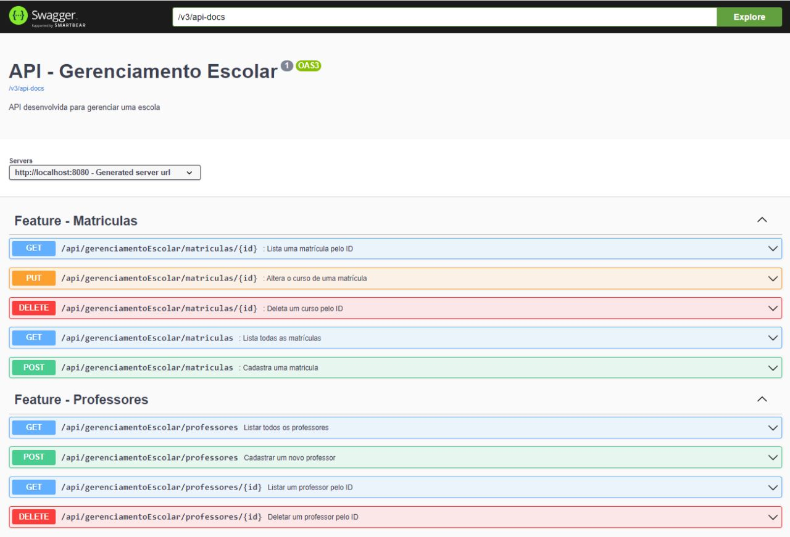
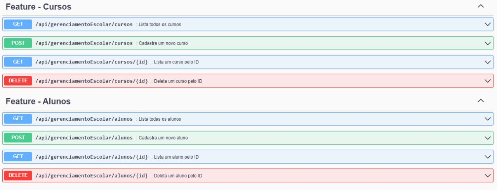
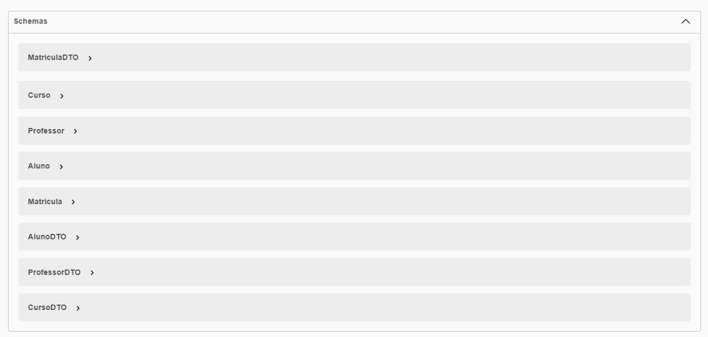

# Gerenciamento Escolar Back e FrontEnd
---

### 🔷 Resumo

<p> 
Objetivo: Criar um aplicativo Java usando o Spring Framework que permite gerenciar alunos, cursos, professores e matrículas em uma escola e usar bootstrap para fazer o frontend.
</p>

<p> BackEnd foi usado um projeto mais antigo, tem algumas coisas para melhorar no código, o foco desse repositório é treinar e aprender frontend e bootstrap.</p>

[Projeto BackEnd Antigo](https://github.com/guiijanuario/API-GerenciamentoEscolar)


<p>Você deverá criar uma API que contém as seguintes funcionalidades</p>

- Cadastro de alunos.
- Cadastro de curso.
- Cadastro de professor.
- Listar todos os alunos.
- Listar todos os professores.
- Listar todos os cursos.
- Atualizar curso do aluno.
- Deletar curso.
- Deletar aluno.
- Deletar professor.


<p>
Estidades:
</p>

1. Aluno: ID, nome, idade, e-mail.
2. Curso: ID, nome, carga horária.
3. Matrícula: ID, data da matrícula, aluno, curso.
4. Professor: ID, nome, idade, curso, salario.

<p>
DTOs:
</p>

1. AlunoDTO
2. CursoDTO
3. MatriculaDTO
4. ProfessorDTO

---

## ⏯️ Como executar os Programas

- Você precisará ter o [JDK 17](https://www.oracle.com/java/technologies/downloads/#java17) instalado no seu computador;
- Baixe o repositório do projeto (com todos os algoritmos);
- Abra o terminal e navegue até o o arquivo ApiBibliotecaApplication presente na pasta de exercício que você deseja executar;
- Compile o arquivo executando o comando `javac`, como mostra abaixo o exemplo executando o [Main](https://github.com/guiijanuario/StarWars-ExerciseModulo4/blob/main/src/main/java/org/example/exerciseModule4/Main.java) :
```
javac Main.java
```
- Após compilar, execute o comando `java`, como mostra abaixo:
```
java Main.java
```


### 🗂️ Documentação com Swagger

- Após rodar o projeto acessar o link: [Link Swagger](http://localhost:8080/swagger-ui/index.html#/)







---

## 👨‍💻 Autor

Nome: Guilherme Januário <br>Linkedin: https://www.linkedin.com/in/guilherme-janu%C3%A1rio/

---

<h4 align=center>©️ Made with 💚 by <a href="https://github.com/guiijanuario">Guilherme Januário</a></h4>
