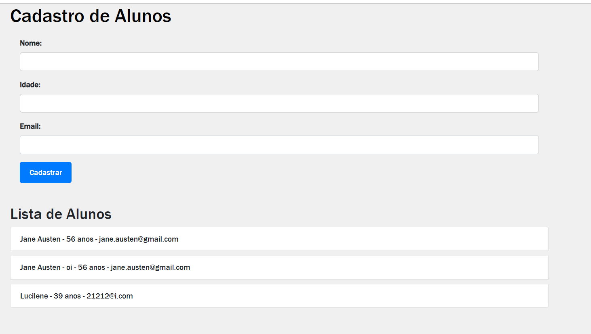

### Testes para CursoController e outros com a mesma lógica

Neste documento, apresentamos os testes unitários desenvolvidos para a classe `CursoController`, que é responsável por lidar com as operações relacionadas a cursos na nossa aplicação. Os testes foram organizados de acordo com as melhores práticas e seguem o padrão Arrange-Act-Assert (AAA).

Mais abaixo segue a documentação sobre a implementação básica de um Front-end.

### Organização dos Testes

Os testes foram estruturados em três partes distintas:

1. **Arrange**: Preparação do cenário, incluindo a configuração de comportamentos de mocks e estados iniciais.
2. **Act**: Execução da ação que está sendo testada, como a chamada a um endpoint específico.
3. **Assert**: Verificação dos resultados obtidos com base nas expectativas definidas.

### Teste de Listar Todos os Cursos

O objetivo deste teste é verificar se o endpoint para listar todos os cursos funciona conforme o esperado. É importante garantir que a resposta contenha os cursos esperados.

```java
@Test
public void testListarTodosCursos() throws Exception {
    // Arrange
    given(cursoService.listarTodosCursos()).willReturn(cursos);

    // Act & Assert
    mockMvc.perform(MockMvcRequestBuilders.get("/api/cursos"))
        .andExpect(MockMvcResultMatchers.status().isOk())
        .andExpect(MockMvcResultMatchers.jsonPath("$.length()").value(2))
        .andExpect(MockMvcResultMatchers.jsonPath("$[0].nome").value("Matemática"))
        .andExpect(MockMvcResultMatchers.jsonPath("$[1].nome").value("História"));
}
```
### Teste de Listar Curso por ID Existente

Neste teste, estamos verificando se o endpoint para listar um curso por ID existente está funcionando corretamente. Isso inclui a validação da resposta recebida e dos valores esperados.

```java
@Test
public void testListarCursoPorIdExistente() throws Exception {
// Arrange
given(cursoService.listarCursoPorId(1L)).willReturn(Optional.of(cursos.get(0)));

    // Act & Assert
    mockMvc.perform(MockMvcRequestBuilders.get("/api/cursos/{id}", 1L))
        .andExpect(MockMvcResultMatchers.status().isOk())
        .andExpect(MockMvcResultMatchers.jsonPath("$.nome").value("Matemática"));
}
```

### Teste de Listar Curso por ID Não Existente

Este teste tem como objetivo verificar se o endpoint para listar um curso por ID não existente retorna o status de "não encontrado" conforme o esperado.

```java
@Test
public void testListarCursoPorIdNaoExistente() throws Exception {
    // Arrange
    given(cursoService.listarCursoPorId(3L)).willReturn(Optional.empty());

    // Act & Assert
    mockMvc.perform(MockMvcRequestBuilders.get("/api/cursos/{id}", 3L))
        .andExpect(MockMvcResultMatchers.status().isNotFound());
}
```


# Documentação do Front-end

Este documento fornece uma visão geral de um básico front-end da aplicação, incluindo instruções sobre como usar, personalizar e estender o código.

## Conteúdo

1. **Estrutura de Diretórios**
2. **Configuração Inicial**
3. **Como Usar**
4. **Personalização**
5. **Contribuição**

## 1. Estrutura de Diretórios

A estrutura de diretórios do projeto é organizada da seguinte forma:

```
project-root/
  ├── cadastrar_alunos.html
  ├── css/
  │    └── styles.css
  ├── js/
  │    └── script.js
  
```

- `cadastrar_alunos.html`: Arquivo principal da página HTML.
- `css/`: Diretório contendo os arquivos CSS para estilização.
- `js/`: Diretório contendo o arquivo JavaScript para funcionalidade.

## 2. Configuração Inicial

Antes de usar o front-end, certifique-se de ter o seguinte configurado:

- **Servidor Spring Boot**: Certifique-se de que o servidor Spring Boot esteja em execução e configurado corretamente para lidar com as solicitações do front-end.

## 3. Como Usar

Para usar o front-end, siga estas etapas:

1. Certifique-se de que o servidor Spring Boot esteja em execução.
2. Abra o arquivo `cadastrar_alunos.html` em um navegador web.
3. Você verá um formulário de cadastro de alunos e uma lista de alunos.
4. Preencha o formulário com os dados do aluno e clique no botão "Cadastrar" para adicionar um novo aluno.
5. A lista de alunos será atualizada automaticamente após o cadastro.

## 4. Personalização

Você pode personalizar o front-end da seguinte forma:

- **Estilos**: Edite o arquivo `css/styles.css` para personalizar a aparência da aplicação.
- **Layout**: Modifique o código HTML em `cadastrar_alunos.html` para ajustar a estrutura e o layout da página.
- **Comportamento**: Personalize o arquivo `js/script.js` para adicionar ou modificar funcionalidades específicas.


## 5. Contribuição

Se você deseja contribuir para o desenvolvimento deste front-end, siga estas diretrizes:

- Faça um fork do repositório.
- Crie um branch para suas alterações: `git checkout -b minha-feature`.
- Faça as alterações desejadas.
- Envie um pull request para este repositório.

Agradecemos pela sua contribuição!


### Conclusão

Esses são apenas alguns exemplos dos testes unitários elaborados para a classe CursoController, AlunoController e outros seguindo a mesma lógica. 

Analise esses testes de acordo com a estrutura e requisitos específicos do seu projeto.

A abordagem AAA e o uso de mocks ajudam a garantir a qualidade e a robustez dos testes em sua aplicação.

### Foto da página principal




###### FIM

